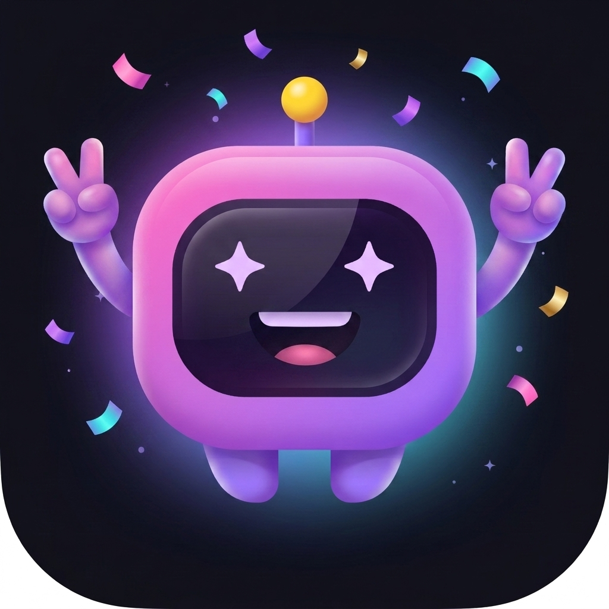

# Vibe Coder Flashcards

543 illustrated flashcards for AI-assisted development — JavaScript, Terminal, Dev Setup (environments + real git workflows), SwiftUI, SQL, Python, CSS, React, and a **Vibe Coding** deck covering prompting, debugging with AI, git survival, and shipping.

Built as a single installable web app: no build step, no dependencies, works offline.



## Run it

| How | Steps |
|---|---|
| **Just open it** | Double-click `index.html`. Everything works from the file system (offline caching and Add-to-Home-Screen need a server, see below). |
| **Local server** | `python3 tools/dev_server.py` in this folder → http://localhost:8123 (caching disabled so edits always show). The offline service worker is skipped on localhost so development stays fresh — add `?sw=1` to the URL to test offline mode locally. |
| **Install as an app (PWA)** | Host the folder anywhere with HTTPS (Netlify / Vercel / GitHub Pages — drag-and-drop deploy works, it is all static files). Then on iPhone: Safari → Share → **Add to Home Screen**. On Android: Chrome → **Install app**. Installed copies run fullscreen, keep progress, and work fully offline. |

## What's inside

- **9 decks / 543 cards** — each card: concept, plain-English description, the prompt to say to your AI, and a copy-paste example.
- **Game modes** — Quiz (multiple choice with combo multipliers), Speed round (60s), Swipe review (Tinder-style, drives the spaced-repetition scheduler), Match (pair names with pictures), and a once-a-day cross-deck **Daily Challenge** (+100 XP), plus daily quests, a guided path per deck with unlockable units, and a "Fix your mistakes" mode.
- **Progression** — XP, 30+ levels with titles (Prompt Apprentice → Vibe Architect → Latent Space Legend), daily streaks with earnable streak freezes, 16 badges, per-card Leitner-box spaced repetition (10 min → 21 days).
- **Juice** — WebAudio-synthesized sound effects (no audio files), confetti, XP fly-ups, haptics on Android, 3D card flips, drag physics.
- **Progress safety** — everything lives in `localStorage` (key `vcf2`); Settings has one-tap Export/Import backup. Progress from the original flashcard pages is migrated automatically on first run.

## Folder map

```
index.html          app shell (load order of all scripts lives here)
manifest.webmanifest / sw.js    PWA install + offline cache (bump CACHE_VERSION when deploying changes)
css/                base tokens · components · screens · games
js/core/            namespace/utils · store(+v1 migration) · srs · gamify · audio · haptics · fx · router
js/ui/              shared components · app chrome (HUD, tabs, modals)
js/screens/         home · deck browser · stats · settings · selftest (#/selftest)
js/games/           quiz · speed · swipe · match · daily
data/               deck-*.js — one self-registering file per deck
assets/             icons (from the generated 1024 app icon) · mascot art
tools/extract_decks.py   regenerates data/ from legacy/ (already run)
legacy/             untouched original pages
*-flashcards.html   redirect stubs so old links keep working
```

**Add a new deck**: copy `data/deck-vibe.js`, change the id/meta/cards, add a `<script>` tag to `index.html`, add the file to `SHELL` in `sw.js`, and add the id to `VCF.DECK_ORDER` in `js/core/namespace.js`. Card shape: `{n: name, c: categoryId, d: description, p: AI prompt, x: example}`.

**Hidden test route**: open `#/selftest` — 30 logic assertions should show ALL PASS.

---

## Shipping to the App Store / Play Store later (Capacitor)

The folder is already structured as a clean web root, so wrapping it is mechanical. Do this **on this Mac**, in this folder, when you're ready:

### 0. One-time installs
- **Xcode** from the Mac App Store (big download), then `xcode-select --install`
- **Android Studio** from developer.android.com (bundles the Android SDK)
- **Node.js** (already installed: v25)
- Apple Developer Program membership — $99/yr — required to put an app on the App Store. Google Play developer account — $25 one-time.

### 1. Wrap
```bash
cd "/Volumes/1TB Dock/Vibe coder flashcards"
npm init -y
npm install @capacitor/core @capacitor/cli
npx cap init "Vibe Coder Flashcards" "com.yourname.vibecards" --web-dir .
npm install @capacitor/ios @capacitor/android
npx cap add ios
npx cap add android
```
Notes:
- `--web-dir .` uses this folder as the app content. If Capacitor complains about copying the `ios/`/`android/`/`legacy/` folders into themselves, the tidy fix is: create a `www/` folder, move the web files (`index.html`, `css/`, `js/`, `data/`, `assets/`, `manifest.webmanifest`, `sw.js`, `*-flashcards.html`) into it, and use `--web-dir www`.
- Add `"appendUserAgent": "vibecards-native"` to `capacitor.config.json` if you ever want to detect native.

### 2. App icons & splash
```bash
npm install @capacitor/assets --save-dev
mkdir -p resources && cp assets/icons/icon-fullbleed-1024.png resources/icon.png
npx capacitor-assets generate
```
That generates every iOS/Android icon and splash size from the 1024 icon that's already in the project.

### 3. Open, run, ship
```bash
npx cap sync        # re-run after every web change
npx cap open ios    # opens Xcode: pick your Team in Signing & Capabilities, choose a simulator or device, press ▶
npx cap open android# opens Android Studio: press ▶ for an emulator/device
```
- **iOS ship**: Xcode → Product → Archive → Distribute App → App Store Connect. Create the listing at appstoreconnect.apple.com (screenshots, description, privacy: "no data collected" — everything is on-device).
- **Android ship**: Android Studio → Build → Generate Signed App Bundle (create a keystore, keep it safe) → upload the `.aab` at play.google.com/console.

### What changes in the code when native? Nothing required.
The app detects its environment: the service worker only registers on http(s), haptics only fire where supported. Optional upgrades later: `@capacitor/haptics` for iPhone haptics (iOS Safari has none) and `@capacitor/preferences` to move progress out of WebView localStorage into native storage.

---

*Progress data note: exporting a backup from Settings before switching devices is always the safe move — localStorage is per-browser, per-device.*
