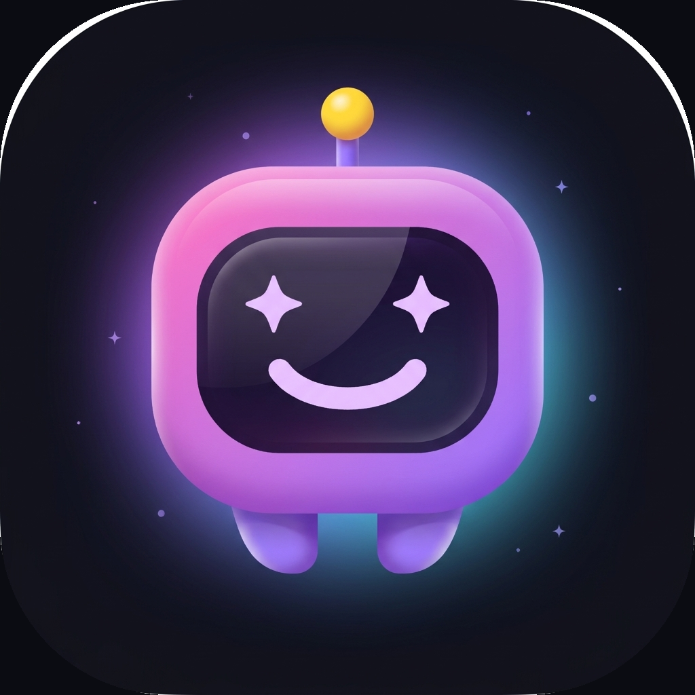

<div align="center">



# Vibe Coder Flashcards

**Learn the words. Ship the app.**

718 illustrated flashcards that make you fluent with your AI — the vocabulary, prompts, and workflows behind AI-assisted development.

[**▶ Open the app**](https://cards.evergreencontent.app) · [App Store](https://apps.apple.com/app/id6794836223) · [Google Play](https://play.google.com/store/apps/details?id=app.evergreencontent.cards) · [Buy me a coffee ☕](https://buymeacoffee.com/nicopdev)

`718 cards` · `13 decks` · `6 game modes` · installable PWA · works offline · zero dependencies

</div>

---

## What it is

A learning app for "vibe coders" — beginners, designers, and indie hackers who build with AI assistance. Instead of teaching you to write every line by hand, it teaches you the **language** you need to direct an AI well: the right component to ask for, the right query shape, the right git move, the exact prompt that gets it in one shot.

Every card has four parts: the concept, a plain-English description, **the prompt to say to your AI**, and a copy-paste example.

**Decks:** Vibe Coding · Prompt Craft · How LLMs Work · AI Coding Tools · AI Failure Modes · JavaScript · Terminal · Dev Setup (environments + real git workflows) · SwiftUI · SQL · Python · CSS · React

## Why it exists

A vague prompt burns thousands of tokens in failed round-trips before it lands. Knowing the right word — `LazyVGrid`, `git restore`, `.env`, "make it idempotent" — skips the guesswork. Fluency is the cheapest upgrade your AI subscription will ever get. The app leans into that: a running "tokens saved" estimate turns learning into a visible return.

## How you learn

- **Quiz** — multiple choice with combo multipliers
- **Prompt Pick** — read the situation, choose the prompt you would actually say to your AI
- **Speed** — how many can you nail in 60 seconds?
- **Swipe** — Tinder-style review that feeds a spaced-repetition scheduler
- **Match** — pair concepts with their illustrations against the clock
- **Daily Challenge** — 10 mixed cards, once a day, seeded from the date
- **Guided paths** — each deck is a trail of unlockable units, gold at mastery
- Plus daily quests, streaks with earnable freezes, XP, levels, badges, and a "fix your mistakes" mode that resurfaces whatever keeps tripping you up

## Under the hood

The interesting part, if you're here to look at the engineering:

- **No build step, no framework, no dependencies.** Plain ES5-ish JavaScript, classic `<script>` tags, one `window.VCF` namespace. Clone-and-open works; there's nothing to install or compile.
- **Spaced repetition** — a lightweight Leitner system (boxes 0–6, intervals from 10 minutes to 21 days) schedules every card; the swipe and review queues pull what's actually due.
- **Everything on-device.** All progress lives in a single `localStorage` key. No accounts, no server, no analytics, no tracking — the app has no backend of its own.
- **Offline-first PWA.** A service worker precaches the whole shell; once loaded it runs with the network unplugged. Installs to the home screen and launches fullscreen like a native app.
- **Synthesized audio.** Every sound — flips, combos, level-up fanfares — is generated live with the Web Audio API. Zero audio files ship.
- **Hand-drawn everything.** All 718 card illustrations, deck icons, badges, and the animated mascot are inline SVG. The one raster asset is the app icon.
- **A hidden self-test** at `#/selftest` runs 38 logic assertions (SRS transitions, streak/date math, save migration, quest seeding) in the browser — the app checks its own core logic on demand.

## Architecture

```
index.html                    app shell — ordered <script> loads, PWA meta
manifest.webmanifest, sw.js   install + versioned offline cache
css/     base · components · screens · games          (design tokens + layout)
js/core/ namespace · store · srs · gamify · audio · haptics · fx · router
js/ui/   components (cards, mascot, rings) · shell (HUD, tabs, modals)
js/screens/  home · deck · path · stats · settings · onboarding · selftest
js/games/    quiz · speed · swipe · match · daily
data/    deck-*.js — one self-registering file per deck
```

Hash-based router, event-bus decoupling between logic and UI, and a store layer that migrates older save formats forward and guards against stale-tab overwrites. The whole thing is a single-page app that also degrades gracefully to `file://`.

## Privacy

Nothing leaves your device. Progress is stored only in your browser. Fonts load once from Google Fonts, then it's fully offline. If you support the project, payment is handled entirely by Buy Me a Coffee — the app never sees it. Full note: [privacy.html](privacy.html).

## License & contact

© 2026 Evergreen Content. **All rights reserved** — this is a proprietary project, not a template. Please don't copy, rehost, or redistribute the code or content. See [LICENSE](LICENSE).

Questions, feedback, or want something similar built? **contact@evergreencontent.app** · more at [evergreencontent.app](https://www.evergreencontent.app)

<div align="center"><sub>Made with good vibes.</sub></div>
